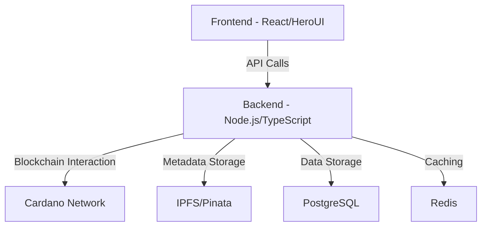
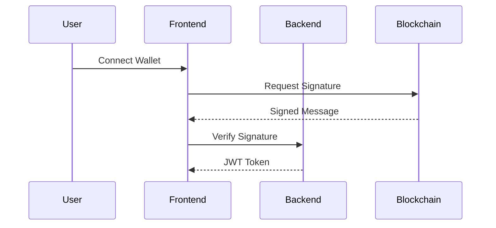
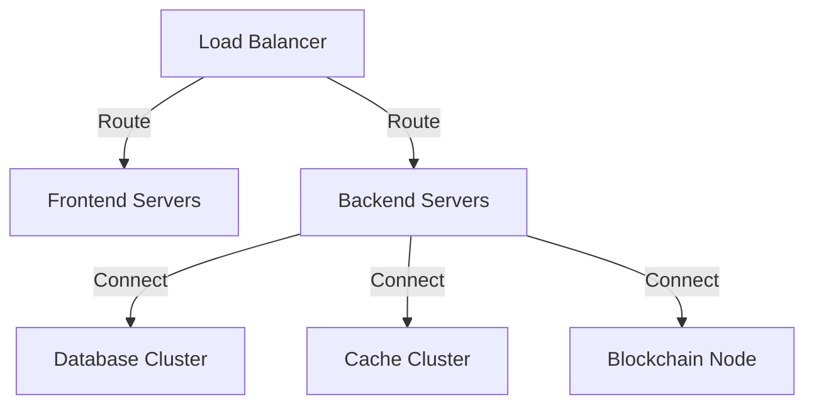

# Project Architecture Documentation

## System Architecture Overview

### High-Level Architecture


## Component Architecture

### 1. Frontend Layer
```
Frontend/
├── Components/
│   ├── Agents/
│   ├── Marketplace/
│   ├── Wallet/
│   └── Common/
├── Pages/
├── Hooks/
├── Stores/
└── Utils/
```

#### Key Technologies:
- React with TypeScript
- HeroUI Component Library
- TailwindCSS for styling
- Framer Motion for animations
- React Query for data fetching
- Zustand for state management

### 2. Backend Layer
```
Backend/
├── src/
│   ├── controllers/
│   ├── services/
│   ├── entities/
│   ├── middlewares/
│   ├── utils/
│   └── config/
├── tests/
└── docs/
```

#### Key Technologies:
- Node.js with TypeScript
- Express.js framework
- TypeORM for database
- Lucid Evolution for Cardano
- JWT for authentication
- WebSocket for real-time

### 3. Blockchain Layer
```
Blockchain/
├── contracts/
│   ├── marketplace/
│   ├── access/
│   └── token/
├── scripts/
└── tests/
```

#### Key Technologies:
- Cardano blockchain
- Plutus smart contracts
- Lucid Evolution SDK
- Blockfrost API

### 4. Storage Layer
```
Storage/
├── Database/
│   ├── migrations/
│   ├── seeds/
│   └── models/
├── Cache/
└── IPFS/
```

#### Key Technologies:
- PostgreSQL for relational data
- Redis for caching
- IPFS/Pinata for metadata
- S3 for file storage

## Service Architecture

### 1. Core Services

#### Agent Service
- Agent creation and management
- Metadata handling
- Access control
- Usage tracking

#### Marketplace Service
- Listing management
- Purchase processing
- Price management
- Transaction handling

#### Wallet Service
- Wallet connection
- Transaction signing
- Balance checking
- Address management

### 2. Support Services

#### Authentication Service
- User authentication
- JWT management
- Session handling
- Role management

#### Notification Service
- Transaction notifications
- System alerts
- User notifications
- Email notifications

#### Monitoring Service
- Transaction monitoring
- System health checks
- Performance monitoring
- Error tracking

## Data Architecture

### 1. Database Schema

#### Users
```sql
CREATE TABLE users (
    id UUID PRIMARY KEY,
    wallet_address VARCHAR(255) UNIQUE,
    email VARCHAR(255),
    created_at TIMESTAMP,
    updated_at TIMESTAMP
);
```

#### Agents
```sql
CREATE TABLE agents (
    id UUID PRIMARY KEY,
    name VARCHAR(255),
    description TEXT,
    metadata_uri VARCHAR(255),
    creator_id UUID,
    created_at TIMESTAMP,
    updated_at TIMESTAMP
);
```

#### Listings
```sql
CREATE TABLE listings (
    id UUID PRIMARY KEY,
    agent_id UUID,
    price DECIMAL,
    type VARCHAR(50),
    status VARCHAR(50),
    created_at TIMESTAMP,
    updated_at TIMESTAMP
);
```

### 2. Cache Structure

#### Session Cache
```typescript
interface SessionCache {
  userId: string;
  token: string;
  permissions: string[];
  expiresAt: number;
}
```

#### Transaction Cache
```typescript
interface TransactionCache {
  txHash: string;
  status: string;
  confirmations: number;
  lastChecked: number;
}
```

## Security Architecture

### 1. Authentication Flow


### 2. Authorization Matrix

| Role | Create Agent | Purchase | Manage Listings | Access API |
|------|-------------|-----------|----------------|------------|
| User | ❌ | ✅ | ❌ | ✅ |
| Creator | ✅ | ✅ | ✅ | ✅ |
| Admin | ✅ | ✅ | ✅ | ✅ |

## Deployment Architecture

### 1. Infrastructure


### 2. Environment Configuration

#### Development
```env
NODE_ENV=development
API_URL=http://localhost:3000
DB_URL=postgresql://localhost:5432/dev
REDIS_URL=redis://localhost:6379
```

#### Production
```env
NODE_ENV=production
API_URL=https://api.example.com
DB_URL=postgresql://prod:5432/prod
REDIS_URL=redis://prod:6379
```

## Monitoring Architecture

### 1. Metrics Collection
- API response times
- Error rates
- Transaction success rates
- Resource utilization

### 2. Logging Structure
- Application logs
- Error logs
- Access logs
- Transaction logs

### 3. Alerting System
- Error thresholds
- Performance alerts
- Security alerts
- Usage alerts

## Future Architecture Considerations

### 1. Scalability
- Microservices migration
- Database sharding
- Load balancing
- CDN integration

### 2. Performance
- Caching strategies
- Query optimization
- Asset optimization
- Network optimization

### 3. Security
- Multi-factor authentication
- Advanced encryption
- Rate limiting
- DDoS protection 