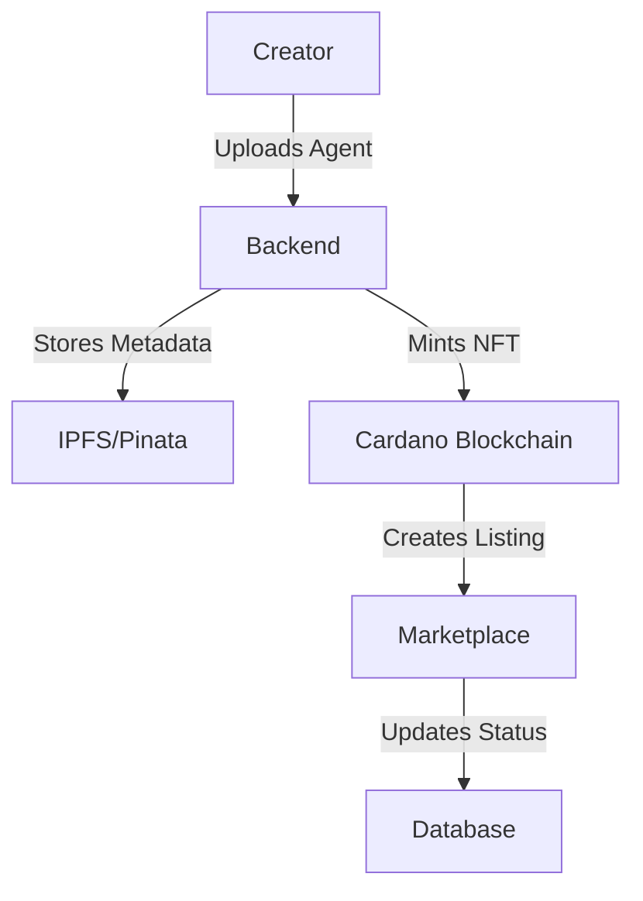
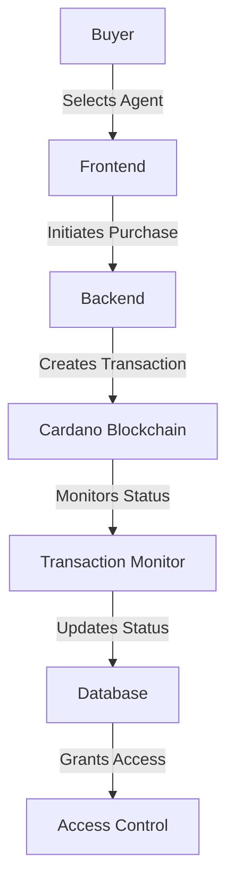
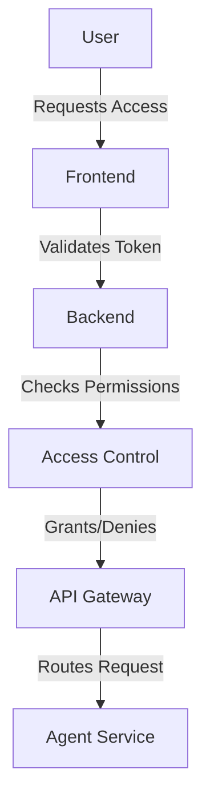

# Project Flow Documentation

## System Overview
The AI Agent Marketplace is a decentralized platform that enables users to create, list, purchase, and manage AI agents using NFTs on the Cardano blockchain.

## Core Flows

### 1. Agent Creation and Listing Flow

1. **Metadata Upload**
   - Creator provides agent details
   - Backend validates metadata
   - Metadata uploaded to IPFS via Pinata
   - Returns IPFS hash (CID)

2. **NFT Minting**
   - Backend creates NFT transaction
   - Includes IPFS metadata URI
   - Mints NFT on Cardano
   - Returns transaction hash

3. **Listing Creation**
   - Creator sets pricing
   - Backend creates listing
   - Updates database
   - Returns listing ID

### 2. Purchase Flow

1. **Purchase Initiation**
   - Buyer selects agent
   - Chooses purchase type (one-time/subscription)
   - Frontend initiates purchase
   - Backend creates transaction

2. **Transaction Processing**
   - Backend builds transaction
   - Buyer signs transaction
   - Transaction submitted to blockchain
   - Monitor service tracks status

3. **Access Granting**
   - Transaction confirmed
   - Backend updates purchase status
   - Generates access credentials
   - Grants access to buyer

### 3. Access Management Flow

1. **Access Request**
   - User authenticates
   - Presents access token
   - Backend validates token
   - Checks permissions

2. **Service Access**
   - Validates subscription
   - Routes to agent service
   - Tracks usage
   - Manages rate limits

## Data Flow

### 1. Frontend to Backend
- RESTful API communication
- WebSocket for real-time updates
- JWT authentication
- Rate limiting

### 2. Backend to Blockchain
- Lucid Evolution integration
- Transaction building
- UTxO management
- Confirmation monitoring

### 3. Backend to IPFS
- Pinata integration
- Metadata storage
- Content addressing
- Caching strategy

## Error Handling

### 1. Transaction Errors
- Automatic retry mechanism
- Error logging
- User notification
- Status updates

### 2. API Errors
- Error boundaries
- Fallback UI
- Retry logic
- Error reporting

### 3. Access Errors
- Permission validation
- Token refresh
- Session management
- Error logging

## Monitoring and Logging

### 1. Transaction Monitoring
- Real-time status tracking
- Confirmation counting
- Error detection
- Status updates

### 2. System Monitoring
- Performance metrics
- Error rates
- Usage statistics
- Resource utilization

### 3. User Activity
- Access logs
- Purchase history
- Usage patterns
- Error reports

## Security Measures

### 1. Authentication
- JWT tokens
- Wallet signatures
- Session management
- Rate limiting

### 2. Authorization
- Role-based access
- Permission checks
- Token validation
- IP restrictions

### 3. Data Protection
- Encryption at rest
- Secure communication
- Data validation
- Access control

## Future Improvements

### 1. Performance
- Caching implementation
- Load balancing
- CDN integration
- Query optimization

### 2. Scalability
- Microservices architecture
- Database sharding
- Cache distribution
- Load distribution

### 3. Features
- Advanced analytics
- Social features
- Version control
- Multi-chain support 