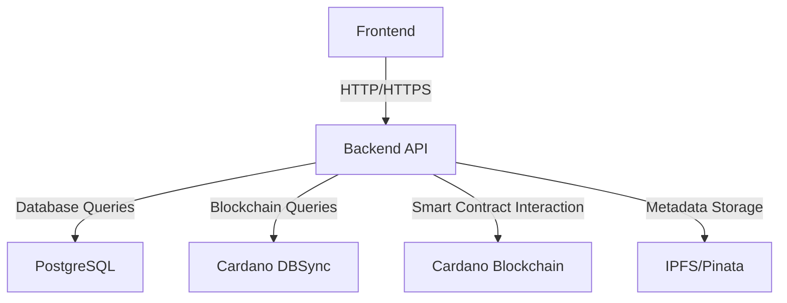
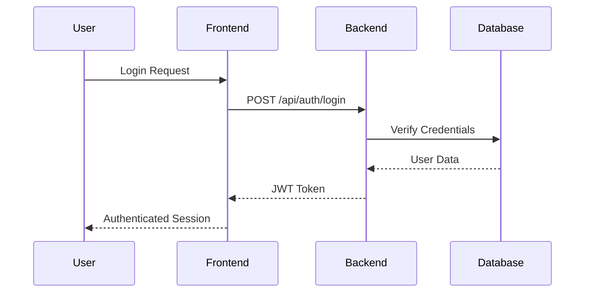
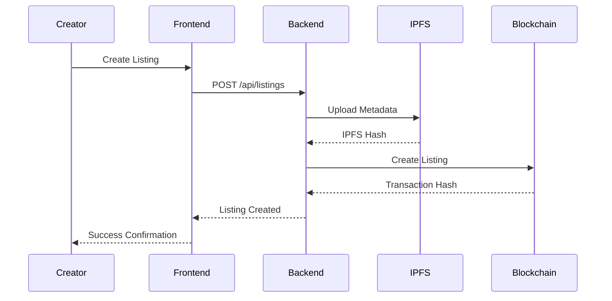
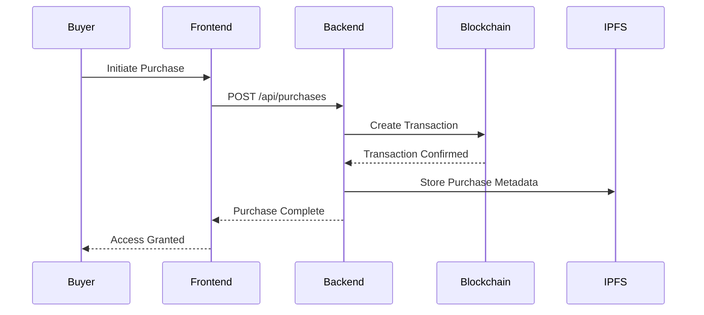

# LegionX Project Flow

## System Architecture Overview

## Component Interaction Flow

### 1. Authentication Flow

### 2. AI Agent Listing Flow

### 3. Purchase Flow

## API Endpoints

### Authentication
- `POST /api/auth/login` - User login
- `POST /api/auth/register` - User registration
- `GET /api/auth/me` - Get current user

### Listings
- `GET /api/listings` - Get all listings
- `GET /api/listings/:id` - Get specific listing
- `POST /api/listings` - Create new listing
- `PUT /api/listings/:id` - Update listing
- `DELETE /api/listings/:id` - Delete listing

### Purchases
- `POST /api/purchases` - Create purchase
- `GET /api/purchases` - Get user's purchases
- `GET /api/purchases/:id` - Get specific purchase

### Access Control
- `GET /api/access/metadata/:assetId` - Get NFT metadata
- `GET /api/access/verify/:assetId` - Verify access rights

## Data Flow

1. **Frontend to Backend**
   - RESTful API calls
   - JWT authentication
   - JSON data format
   - WebSocket for real-time updates

2. **Backend to Blockchain**
   - Lucid service for transaction building
   - DBSync for blockchain data querying
   - Smart contract interaction

3. **Backend to IPFS**
   - Metadata storage
   - Content addressing
   - Pinata integration

## Security Measures

1. **Authentication**
   - JWT token-based authentication
   - Secure password hashing
   - Rate limiting

2. **Data Protection**
   - Input validation
   - SQL injection prevention
   - XSS protection

3. **Blockchain Security**
   - Transaction signing
   - Smart contract validation
   - Wallet verification

## Error Handling

1. **Frontend**
   - User-friendly error messages
   - Retry mechanisms
   - Fallback UI states

2. **Backend**
   - Structured error responses
   - Logging and monitoring
   - Transaction rollback

## Performance Considerations

1. **Caching**
   - Redis for session data
   - Browser caching
   - API response caching

2. **Optimization**
   - Database indexing
   - Query optimization
   - Asset compression

## Monitoring and Logging

1. **Backend Monitoring**
   - API performance metrics
   - Error tracking
   - User activity logs

2. **Blockchain Monitoring**
   - Transaction status
   - Smart contract events
   - Network health 