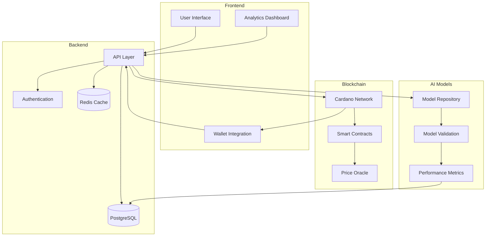
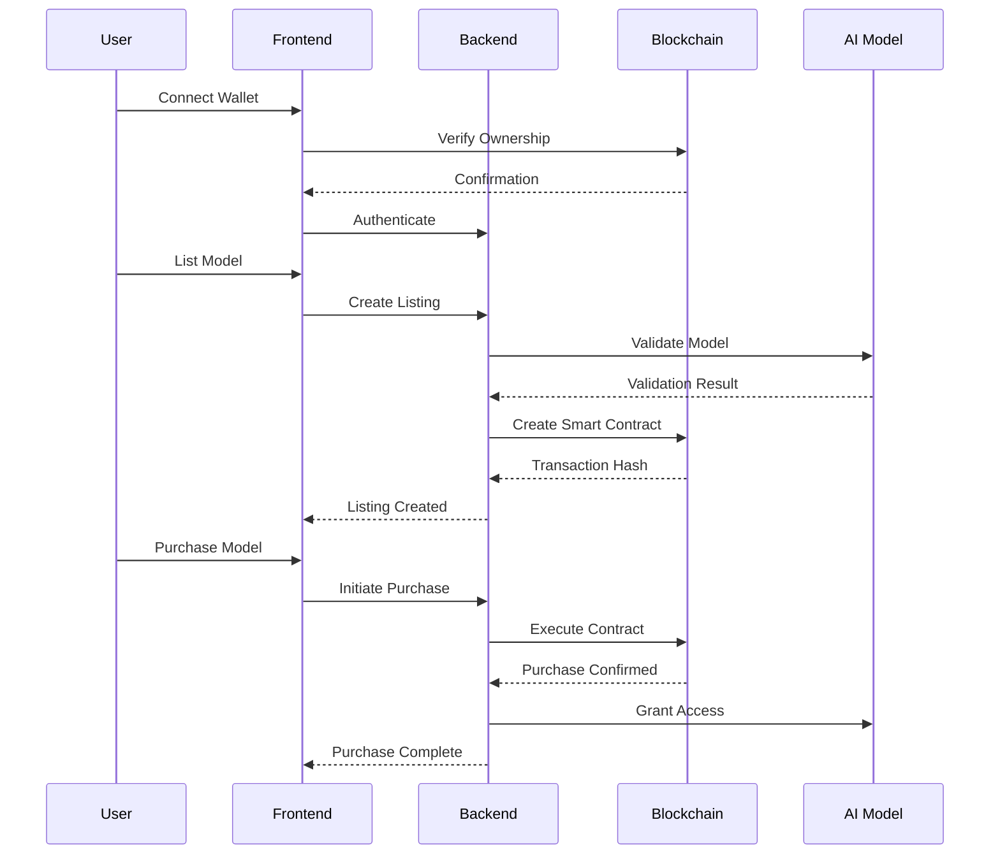
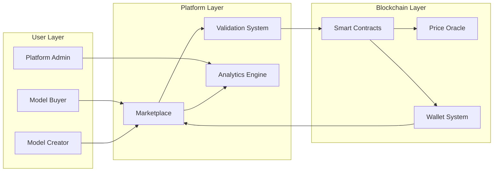
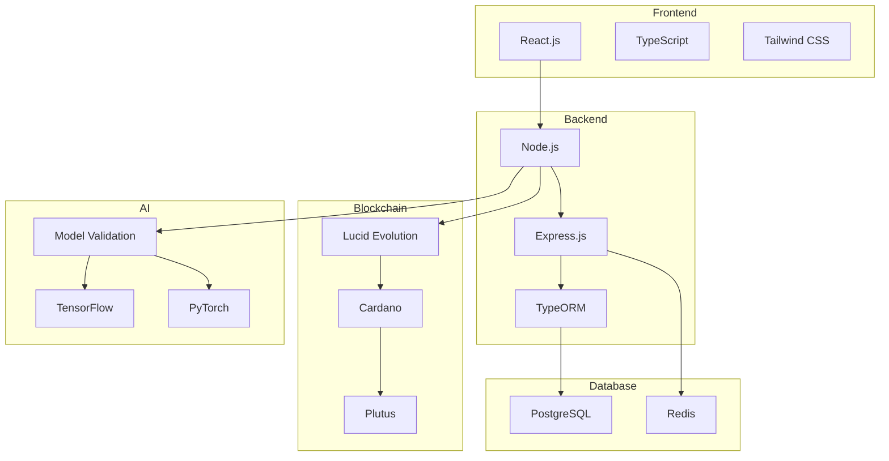

# LegionX Project Overview

## System Architecture

```mermaid
graph TB
    subgraph Frontend
        UI[User Interface]
        Wallet[Wallet Integration]
        Analytics[Analytics Dashboard]
    end

    subgraph Backend
        API[API Layer]
        Auth[Authentication]
        DB[(PostgreSQL)]
        Cache[(Redis Cache)]
    end

    subgraph Blockchain
        Cardano[Cardano Network]
        SC[Smart Contracts]
        Oracle[Price Oracle]
    end

    subgraph AI Models
        ModelRepo[Model Repository]
        Validation[Model Validation]
        Metrics[Performance Metrics]
    end

    %% Frontend connections
    UI --> API
    Wallet --> API
    Analytics --> API

    %% Backend connections
    API --> Auth
    API --> DB
    API --> Cache
    API --> Cardano
    API --> ModelRepo

    %% Blockchain connections
    Cardano --> SC
    SC --> Oracle
    Cardano --> Wallet

    %% AI Model connections
    ModelRepo --> Validation
    Validation --> Metrics
    Metrics --> DB
```

## Data Flow

```mermaid
sequenceDiagram
    participant User
    participant Frontend
    participant Backend
    participant Blockchain
    participant AI Model

    User->>Frontend: Connect Wallet
    Frontend->>Blockchain: Verify Ownership
    Blockchain-->>Frontend: Confirmation
    Frontend->>Backend: Authenticate

    User->>Frontend: List Model
    Frontend->>Backend: Create Listing
    Backend->>AI Model: Validate Model
    AI Model-->>Backend: Validation Result
    Backend->>Blockchain: Create Smart Contract
    Blockchain-->>Backend: Transaction Hash
    Backend-->>Frontend: Listing Created

    User->>Frontend: Purchase Model
    Frontend->>Backend: Initiate Purchase
    Backend->>Blockchain: Execute Contract
    Blockchain-->>Backend: Purchase Confirmed
    Backend->>AI Model: Grant Access
    Backend-->>Frontend: Purchase Complete
```

## Component Interaction

```mermaid
graph LR
    subgraph User Layer
        Buyer[Model Buyer]
        Seller[Model Creator]
        Admin[Platform Admin]
    end

    subgraph Platform Layer
        Marketplace[Marketplace]
        Validation[Validation System]
        Analytics[Analytics Engine]
    end

    subgraph Blockchain Layer
        Contracts[Smart Contracts]
        Oracle[Price Oracle]
        Wallet[Wallet System]
    end

    %% User interactions
    Buyer --> Marketplace
    Seller --> Marketplace
    Admin --> Analytics

    %% Platform interactions
    Marketplace --> Validation
    Marketplace --> Analytics
    Validation --> Contracts

    %% Blockchain interactions
    Contracts --> Oracle
    Contracts --> Wallet
    Wallet --> Marketplace
```

## Technology Stack

```mermaid
graph TB
    subgraph Frontend
        React[React.js]
        TypeScript[TypeScript]
        Tailwind[Tailwind CSS]
    end

    subgraph Backend
        Node[Node.js]
        Express[Express.js]
        TypeORM[TypeORM]
    end

    subgraph Blockchain
        Cardano[Cardano]
        Plutus[Plutus]
        Lucid[Lucid Evolution]
    end

    subgraph Database
        Postgres[PostgreSQL]
        Redis[Redis]
    end

    subgraph AI
        TensorFlow[TensorFlow]
        PyTorch[PyTorch]
        Validation[Model Validation]
    end

    %% Stack connections
    React --> Node
    Node --> Express
    Express --> TypeORM
    TypeORM --> Postgres
    Express --> Redis
    Node --> Lucid
    Lucid --> Cardano
    Cardano --> Plutus
    Node --> Validation
    Validation --> TensorFlow
    Validation --> PyTorch
``` 