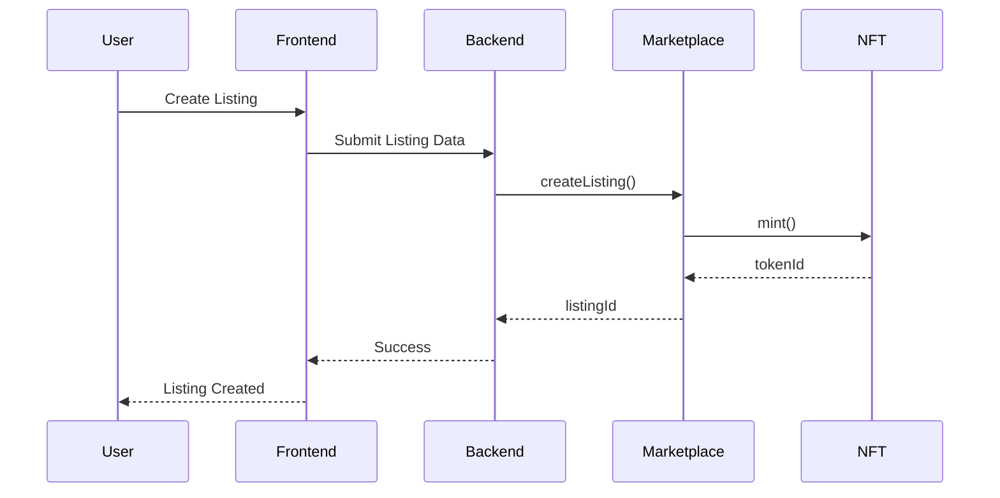
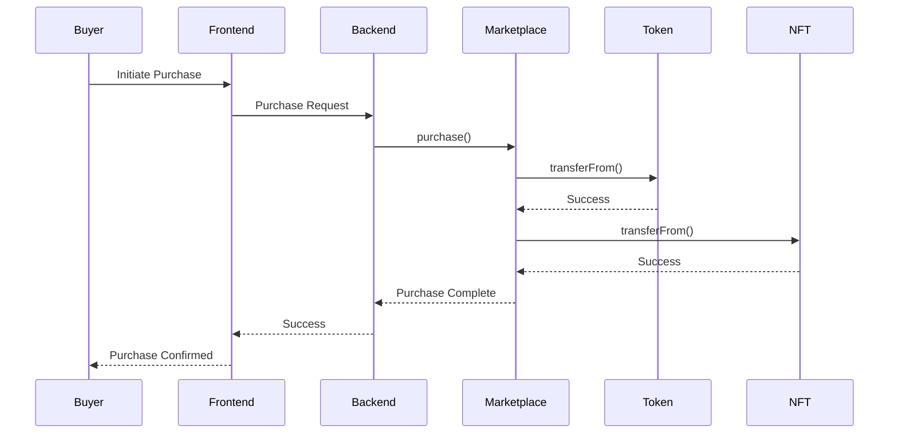

# LegionX Smart Contract Flow

## Contract Overview

### 1. LegionXMarketplace.sol
Main marketplace contract that handles:
- Listing creation and management
- Purchase transactions
- Subscription management
- Royalty distribution

### 2. LegionXToken.sol
ERC20 token contract for:
- Platform token (LEGX)
- Payment processing
- Staking mechanism

### 3. LegionXNFT.sol
ERC721 contract for:
- AI model/tool ownership
- License management
- Transfer restrictions

## Contract Interactions

### Listing Creation Flow


### Purchase Flow


## Smart Contract Features

### 1. Listing Management
- Create listing with metadata
- Update listing details
- Delete/cancel listing
- Set pricing (subscription/full)
- Manage availability

### 2. Purchase System
- One-time purchase
- Subscription management
- Automatic renewals
- Refund handling
- Royalty distribution

### 3. Token Economics
- Platform token utility
- Staking rewards
- Fee distribution
- Governance rights

### 4. Security Features
- Access control
- Pausable functionality
- Emergency stops
- Upgrade mechanism
- Reentrancy protection

## Integration Points

### 1. Backend Integration
```typescript
// Example backend integration
const marketplace = new ethers.Contract(
  MARKETPLACE_ADDRESS,
  MARKETPLACE_ABI,
  provider
);

async function createListing(listingData) {
  const tx = await marketplace.createListing(
    listingData.title,
    listingData.price,
    listingData.uri
  );
  return await tx.wait();
}
```

### 2. Frontend Integration
```typescript
// Example frontend integration
const connectWallet = async () => {
  if (window.ethereum) {
    const accounts = await window.ethereum.request({
      method: 'eth_requestAccounts'
    });
    return accounts[0];
  }
};
```

## Contract Events

### 1. Listing Events
- `ListingCreated`
- `ListingUpdated`
- `ListingDeleted`
- `ListingPurchased`

### 2. Token Events
- `Transfer`
- `Approval`
- `SubscriptionStarted`
- `SubscriptionEnded`

### 3. System Events
- `Paused`
- `Unpaused`
- `Upgraded`
- `EmergencyStop`

## Testing Strategy

### 1. Unit Tests
- Contract functionality
- Access control
- State changes
- Event emissions

### 2. Integration Tests
- Contract interactions
- Token transfers
- Purchase flow
- Subscription management

### 3. Security Tests
- Reentrancy attacks
- Access control
- Input validation
- Gas optimization

## Deployment Process

### 1. Development
- Local testing
- Testnet deployment
- Contract verification
- Integration testing

### 2. Production
- Mainnet deployment
- Contract verification
- Initial setup
- Monitoring setup

### 3. Maintenance
- Performance monitoring
- Gas optimization
- Security updates
- Emergency procedures

## Gas Optimization

### 1. Storage Optimization
- Pack structs
- Use uint256
- Optimize arrays
- Batch operations

### 2. Computation Optimization
- Minimize loops
- Use events
- Optimize math
- Cache values

### 3. Transaction Optimization
- Batch transactions
- Optimize calldata
- Use events
- Minimize storage

## Security Best Practices

### 1. Code Security
- Follow best practices
- Use OpenZeppelin
- Regular audits
- Bug bounties

### 2. Operational Security
- Access control
- Emergency stops
- Upgrade mechanism
- Monitoring

### 3. User Security
- Input validation
- Rate limiting
- Error handling
- User feedback 